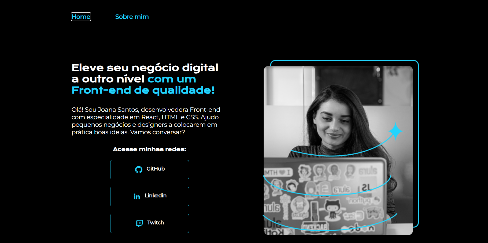

# Projeto: Modelo de Portfólio Profissional

Este projeto é um modelo de portfólio profissional desenvolvido com o objetivo de apresentar habilidades, experiências e projetos de forma visualmente atraente e organizada. É ideal para desenvolvedores, designers e outros profissionais que desejam ter uma presença digital marcante.

## 🛠️ Tecnologias Utilizadas

- **HTML5**
- **CSS**

## 📱 Responsividade

O portfólio foi desenvolvido com foco em **design responsivo**, garantindo uma boa experiência de uso tanto em **telas de computador** quanto em **dispositivos móveis** (smartphones e tablets).
